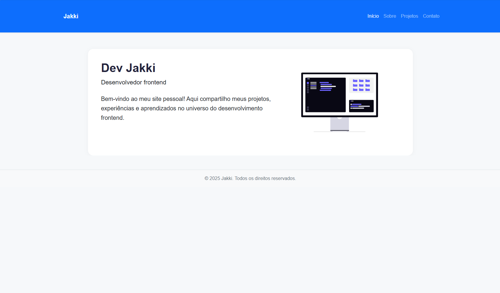
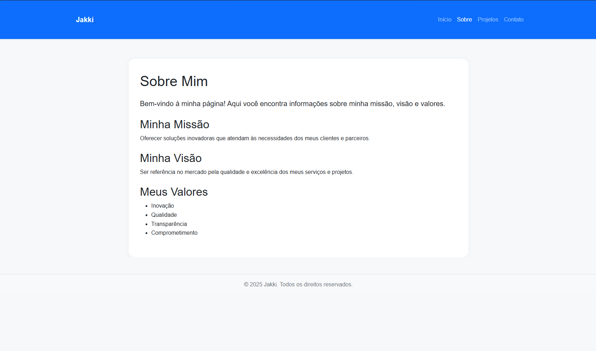
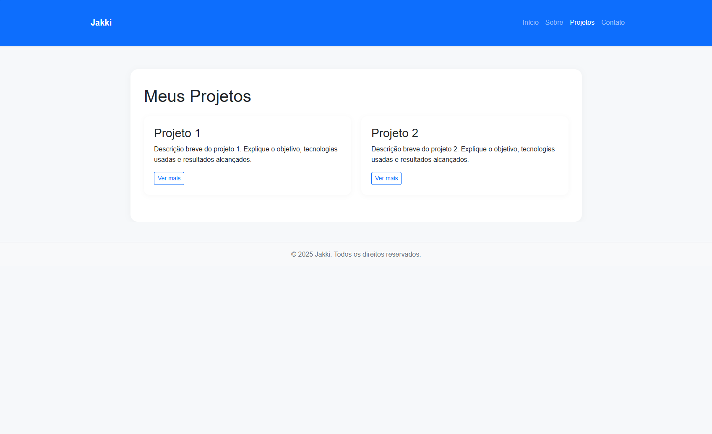
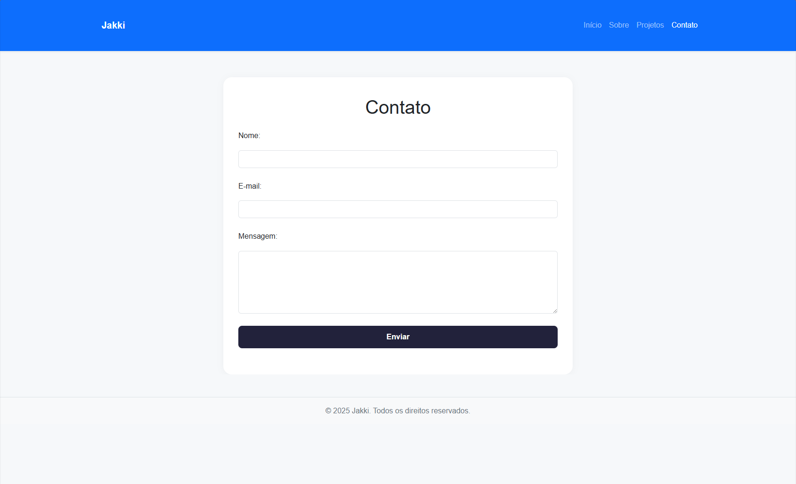

# Projeto de site - Portfólio

## Visão Geral
Este projeto é um site frontend responsivo desenvolvido utilizando HTML5, CSS3 e JavaScript. Ele serve como um portfólio pessoal, exibindo vários projetos e fornecendo um formulário de contato para consultas.

## Estrutura do Projeto
```
atdd-mapa-frontend-es-52-2025
├── node_modules
├── src
│   ├── css
│   │   └── styles.css
│   ├── js
│   │   └── scripts.js
│   ├── images
│   ├── index.html
│   ├── about.html
│   ├── contact.html
│   └── projetos.html
├── .gitignore
├── package-lock.json
├── package.json
└── README.md
```

## Tecnologias Utilizadas
- **HTML5**: Para estruturar o conteúdo do site.
- **CSS3**: Para estilizar o site, garantindo um design visualmente atraente e responsivo.
- **JavaScript**: Para adicionar interatividade, incluindo validação de formulários e efeitos dinâmicos.

## Funcionalidades
- **Layout Responsivo**: O site se adapta a vários tamanhos de tela, proporcionando uma experiência de visualização ideal em desktops, tablets e dispositivos móveis.
- **Menu de Navegação**: Um menu funcional permite que os usuários naveguem facilmente entre as diferentes páginas.
- **Formulário de Contato**: Inclui validação para garantir que todos os campos sejam preenchidos corretamente antes do envio.
- **Efeitos Interativos**: Utiliza JavaScript/jQuery para aprimorar a experiência do usuário com elementos dinâmicos.

## Instruções de Configuração
1. Clone o repositório para sua máquina local.
2. Navegue até o diretório do projeto.
3. Abra o arquivo `src/index.html` em seu navegador para visualizar o site.

## Desafios Enfrentados
- Garantir compatibilidade entre navegadores para o design responsivo.
- Implementar validação em JavaScript para o formulário de contato, melhorando a experiência do usuário.
- Equilibrar estética e funcionalidade para criar uma interface envolvente.

## Melhorias Futuras
- Integrar um serviço backend para lidar com o envio dos formulários.
- Aprimorar recursos de SEO para melhor visibilidade em mecanismos de busca.
- Adicionar mais elementos interativos e animações para aumentar o engajamento do usuário.

## Licença
Este projeto é open-source e está disponível para modificação e distribuição.

IMAGENS DO SITE







